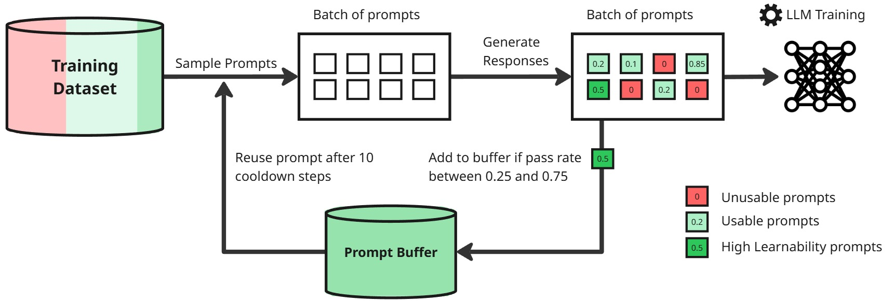

# Prompt Replay

This repository contains code for Prompt replay projects. **Note: This codebase is unclean.**

## Implementation

The main implementation is in `open-instruct/open_instruct/grpo_fast.py`.

## Running

Runs are made with:

- `open-instruct/run_grpo.slurm` + `open-instruct/scripts/train/olmo3/qwen_math_1_5.sh`
- `open-instruct/multinode_run_grpo_7b.slurm` + `open-instruct/scripts/train/olmo3/qwen_math_7_multinode.sh`
